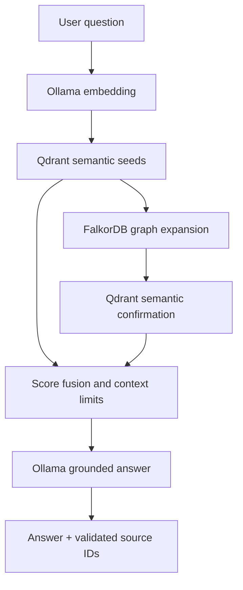

# Vietnamese Legal GraphRAG with FalkorDB + Qdrant

A compact, runnable reference project for Vietnamese legal-document retrieval. It uses:

- **Qdrant** for semantic search over article-aware text chunks.
- **FalkorDB** for document metadata, legal identifiers, signers, issuers, and citation paths.
- **Ollama** for local embeddings and answer generation.
- **FastAPI** for a small query API.

The loader was validated against `khoa_hoc_va_cong_nghe.csv`: 2,389 rows, 14 fields,
approximately 52.5 MB, and individual `Toàn văn` values as large as 2,336,295 characters.
It raises Python's CSV field limit and streams rows instead of loading the corpus at once.
With the default chunk settings, that file produces 40,510 chunks and 13,722
document-to-identifier mention edges before embeddings are generated.

## Retrieval flow



The graph does not replace semantic retrieval. It expands the best Qdrant seed documents
through citations and shared metadata. Qdrant then confirms which chunks from those graph
neighbors are relevant to the actual question. This prevents broad graph neighborhoods from
overwhelming the answer context.

## Graph model

| Source | Relationship | Target | Purpose |
| --- | --- | --- | --- |
| `Document` | `HAS_CHUNK` | `Chunk` | Links graph entities to Qdrant chunk IDs |
| `Document` | `HAS_IDENTIFIER` | `Instrument` | Resolves duplicate or shared legal numbers |
| `Document` | `MENTIONS` | `Instrument` | Captures citations and amendment/repeal hints |
| `Document` | `ISSUED_BY` | `Agency` | Issuing authority |
| `Document` | `IN_SECTOR` | `Sector` | `Ngành` metadata |
| `Document` | `IN_FIELD` | `Field` | `Lĩnh vực` metadata |
| `Document` | `SIGNED_BY` | `Person` | Signer, with position on the relationship |

`MENTIONS.kinds` is a deterministic heuristic (`cites`, `amends`, `replaces`, or `repeals`),
not a final legal interpretation. The generic citation edge remains available even when the
heuristic is uncertain.

The supplied corpus contains duplicate `Số hiệu` values. Citation expansion therefore only
links an identifier to a document when exactly one corpus document owns that identifier;
ambiguous identifiers remain searchable but do not create potentially false document links.

## CSV mapping

The loader expects the following exact UTF-8 column names:

| CSV field | Stored as |
| --- | --- |
| `ID` | Stable document ID |
| `Title` | Document title |
| `Toàn văn` | Article-aware chunks in Qdrant |
| `Số hiệu` | Document number and `Instrument` key |
| `Loại văn bản` | `document_type` payload |
| `Ngành` | `Sector` node and payload |
| `Ngày ban hành` | ISO `issued_date` |
| `Lĩnh vực` | `Field` node and payload |
| `Ngày có hiệu lực` | ISO `effective_date` |
| `Tình trạng hiệu lực` | `status` payload |
| `Ngày hết hiệu lực` | ISO `expiry_date`, empty for `--` |
| `Cơ quan ban hành` | `Agency` node and payload |
| `Chức danh` | `SIGNED_BY.position` |
| `Người ký` | `Person` node |

The Qdrant collection is created only after the first embedding is returned, so its vector
dimension always matches the configured embedding model.

## Quick start

Requirements: Miniconda, Docker with Compose, and Ollama.

```bash
conda create -n legal-graphrag python=3.11 pip -y
conda activate legal-graphrag

cp .env.example .env

ollama pull embeddinggemma
ollama pull gemma4:e4b

docker compose up -d falkordb qdrant
python -m pip install -r requirements.txt
```

`requirements.txt` installs the runtime dependencies, development tooling, and the project
in editable mode so the `legal-graphrag` command is available in the active Conda environment.

Ingest the bundled three-row sample:

```bash
legal-graphrag ingest data/sample_legal_documents.csv --recreate
legal-graphrag stats
legal-graphrag ask "Văn bản nào bãi bỏ Quyết định 01/2026/QĐ-UBND?"
```

Use your supplied corpus by pointing the CLI at its path:

```bash
# A quick end-to-end check first
legal-graphrag ingest /path/to/khoa_hoc_va_cong_nghe.csv --limit 100 --recreate

# Then rebuild with the complete file
legal-graphrag ingest /path/to/khoa_hoc_va_cong_nghe.csv --recreate
```

`--recreate` explicitly clears the configured graph contents and Qdrant collection. Without
it, the loader is incremental: unchanged documents are skipped using a hash of their text,
metadata, chunk settings, embedding model, and schema version.

## API

Run the service:

```bash
legal-graphrag serve --host 0.0.0.0 --port 8000
```

Query it:

```bash
curl -s http://localhost:8000/v1/query \
  -H 'content-type: application/json' \
  -d '{
    "question": "Quy định nào điều chỉnh việc quản lý nhiệm vụ khoa học và công nghệ?",
    "filters": {"status": "Còn hiệu lực"},
    "top_k": 8
  }'
```

The response contains:

- `answer`: grounded Vietnamese answer with `[S1]`-style citations;
- `sources`: retrieved chunks, scores, and whether each source was actually cited;
- `graph_context`: graph neighbors and the paths that introduced them;
- `warnings`: missing or invalid model citations.

Other endpoints:

```text
GET  /health
GET  /v1/stats
POST /v1/query
```

Ingestion is intentionally CLI-only so the web API cannot be used to read arbitrary server
paths.

## Useful commands

```bash
# Exact metadata filters
legal-graphrag ask "Các quy định về đo lường là gì?" \
  --document-type "Quyết định" \
  --status "Còn hiệu lực"

# Component health
legal-graphrag health

# Unit tests (no running databases required)
PYTHONPATH=src python -m unittest discover -s tests -v

# Linting
ruff check src tests
```

FalkorDB's browser is available at `http://localhost:3000`. Qdrant's dashboard is available
at `http://localhost:6333/dashboard`.

Example Cypher queries in the FalkorDB browser:

```cypher
MATCH (d:Document)-[:ISSUED_BY]->(a:Agency)
RETURN d.number, d.title, a.name
LIMIT 20
```

```cypher
MATCH (newer:Document)-[m:MENTIONS]->(i:Instrument)<-[:HAS_IDENTIFIER]-(older:Document)
RETURN newer.number, m.kinds, older.number, older.title
LIMIT 50
```

## Consistency and operational notes

- Each batch is idempotent. A document is marked `index_status = ready` only after its Qdrant
  points and FalkorDB chunk nodes are written. Re-running ingestion repairs a partial batch.
- FalkorDB and Qdrant do not share a transaction. For production, add a durable job ledger,
  retries, and reconciliation metrics.
- Qdrant metadata filters are exact keyword matches. Add normalization or a filter-value
  dictionary if users enter free-form variants.
- If you change to an embedding model with a different vector dimension, the loader raises a
  clear error. Re-run with `--recreate`.
- The included Docker services have no authentication and are for local development. Do not
  expose ports 6379 or 6333 publicly without configuring authentication and network controls.
- This system supports legal-document research; generated answers are not legal advice.

## Project layout

```text
src/legal_graphrag/
  api.py             FastAPI routes
  chunking.py        Vietnamese Điều-aware chunking
  cli.py             ingest, ask, serve, health, stats
  csv_loader.py      streaming 14-field CSV parser
  extraction.py      legal-number and citation heuristics
  graph_store.py     FalkorDB schema, writes, expansion
  llm.py             dependency-free Ollama HTTP client
  pipeline.py        idempotent two-store ingestion
  qdrant_store.py    vector collection, payloads, filters
  retrieval.py       semantic -> graph -> semantic fusion
  service.py         prompts, sources, citation validation
```

## Primary references

- [FalkorDB getting started](https://docs.falkordb.com/getting-started/)
- [FalkorDB parameterized queries](https://docs.falkordb.com/commands/graph.query.html)
- [Qdrant local quickstart](https://qdrant.tech/documentation/quickstart/)
- [Qdrant search and payload filtering](https://qdrant.tech/documentation/search/search/)
- [Ollama embedding API](https://docs.ollama.com/api/embed)
- [Ollama chat API](https://docs.ollama.com/api/chat)
