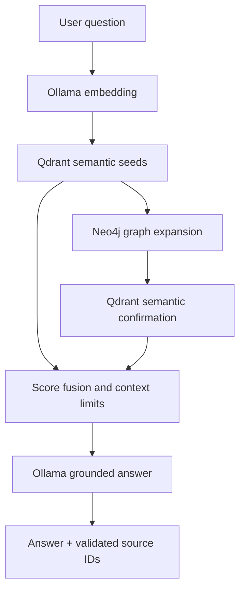

# Vietnamese Legal GraphRAG with Neo4j + Qdrant

A compact, runnable reference project for Vietnamese legal-document retrieval. It uses:

- **Qdrant** for semantic search over article-aware text chunks.
- **Neo4j** for document metadata, legal identifiers, signers, issuers, and citation paths.
- **Ollama** for local embeddings, relation verification, and answer generation.
- **FastAPI** for a small query API.

The loader was validated against `khoa_hoc_va_cong_nghe.csv`: 2,389 rows, 14 fields,
approximately 52.5 MB, and individual `Toàn văn` values as large as 2,336,295 characters.
It raises Python's CSV field limit and streams rows instead of loading the corpus at once.
With the default chunk settings, that file produces 40,510 chunks and 13,722
document-to-identifier mention edges before embeddings are generated.

## Retrieval flow



The graph does not replace semantic retrieval. It expands the best Qdrant seed documents
through citations and shared metadata. Qdrant then confirms which chunks from those graph
neighbors are relevant to the actual question. This prevents broad graph neighborhoods from
overwhelming the answer context.

## Graph model

| Source | Relationship | Target | Purpose |
| --- | --- | --- | --- |
| `Document` | `HAS_CHUNK` | `Chunk` | Links graph entities to Qdrant chunk IDs |
| `Document` | `HAS_IDENTIFIER` | `Instrument` | Resolves duplicate or shared legal numbers |
| `Document` | `MENTIONS` | `Instrument` | Captures citations and amendment/repeal hints |
| `Document` | `ISSUED_BY` | `Agency` | Issuing authority |
| `Document` | `IN_SECTOR` | `Sector` | `Ngành` metadata |
| `Document` | `IN_FIELD` | `Field` | `Lĩnh vực` metadata |
| `Document` | `SIGNED_BY` | `Person` | Signer, with position on the relationship |
| `Document` | `LEGAL_RELATION` | `Document` | Directed, evidence-backed legal relation |
| `Document` | `SHARES_CONCEPT` | `LegalConcept` | Explicitly reviewed phrase with a source chunk |

`MENTIONS.kinds` is a deterministic heuristic (`cites`, `amends`, `replaces`, or `repeals`),
not a final legal interpretation. The generic citation edge remains available even when the
heuristic is uncertain.

The supplied corpus contains duplicate `Số hiệu` values. Citation expansion therefore only
links an identifier to a document when exactly one corpus document owns that identifier;
ambiguous identifiers remain searchable but do not create potentially false document links.

## CSV mapping

The loader expects the following exact UTF-8 column names:

| CSV field | Stored as |
| --- | --- |
| `ID` | Stable document ID |
| `Title` | Document title |
| `Toàn văn` | Article-aware chunks in Qdrant |
| `Số hiệu` | Document number and `Instrument` key |
| `Loại văn bản` | `document_type` payload |
| `Ngành` | `Sector` node and payload |
| `Ngày ban hành` | ISO `issued_date` |
| `Lĩnh vực` | `Field` node and payload |
| `Ngày có hiệu lực` | ISO `effective_date` |
| `Tình trạng hiệu lực` | `status` payload |
| `Ngày hết hiệu lực` | ISO `expiry_date`, empty for `--` |
| `Cơ quan ban hành` | `Agency` node and payload |
| `Chức danh` | `SIGNED_BY.position` |
| `Người ký` | `Person` node |

The Qdrant collection is created only after the first embedding is returned, so its vector
dimension always matches the configured embedding model.

## Quick start

Requirements: Miniconda, Docker with Compose, and Ollama.

```bash
conda create -n legal-graphrag python=3.11 pip -y
conda activate legal-graphrag

cp .env.example .env

ollama pull bge-m3
ollama pull gemma4:e4b

docker compose up -d neo4j qdrant
python -m pip install -r requirements.txt
```

`requirements.txt` installs the runtime dependencies, development tooling, and the project
in editable mode so the `legal-graphrag` command is available in the active Conda environment.

Neo4j connects through `NEO4J_URI`, `NEO4J_USERNAME`, `NEO4J_PASSWORD`, and
`NEO4J_DATABASE` in `.env`. The bundled Community server uses database `neo4j` and
username `neo4j`. Wait for `docker compose ps` to report Neo4j as healthy before ingesting.

When switching an existing installation from FalkorDB, add these settings from
`.env.example`, install the updated requirements, and start the new Neo4j service.
Re-ingest the original CSV to populate Neo4j; existing graph data is not copied automatically.
You can ingest without `--recreate` to retain the existing Qdrant collection. Health and
stats responses now use the `neo4j` key.

Ingest the bundled three-row sample:

```bash
# Use --recreate only with disposable local data.
legal-graphrag ingest data/sample_legal_documents.csv --recreate
legal-graphrag build-relations data/sample_legal_documents.csv
legal-graphrag stats
legal-graphrag ask "Văn bản nào bãi bỏ Quyết định 01/2026/QĐ-UBND?"
```

Use your supplied corpus by pointing the CLI at its path:

```bash
# A quick end-to-end check first
legal-graphrag ingest /path/to/khoa_hoc_va_cong_nghe.csv --limit 100 --recreate

# Then rebuild with the complete file
legal-graphrag ingest /path/to/khoa_hoc_va_cong_nghe.csv --recreate
```

`--recreate` explicitly clears the configured graph contents and Qdrant collection. Without
it, the loader is incremental: unchanged documents are skipped using a hash of their text,
metadata, chunk settings, embedding model, and schema version.

When switching an existing installation to `bge-m3`, set `OLLAMA_EMBED_MODEL=bge-m3`
in `.env`, run `ollama pull bge-m3`, and re-ingest your full corpus with `--recreate`
before querying. This rebuilds the graph and Qdrant collection with the new embeddings.

## Building legal relations

Run `legal-graphrag build-relations <same-csv-path> [--limit N]` after ingesting the
CSV. `--limit` caps **source documents**, while candidates still see every document in
that CSV. Every CSV document must match its ready ingestion hash, and its stored Qdrant
chunks must match the current chunk settings and text. Missing or outdated IDs stop the
build before Ollama calls or relation writes. Identifier ambiguity is checked against all
Neo4j owners, including documents outside the CSV; references outside the selected CSV
corpus remain unresolved. Use the full ingestion CSV to include those targets.

Candidate discovery combines:

- Exact document-number spans in chunk bodies, resolved through `Instrument` ownership.
  These produce `CITES` and are always retained for verification.
- Existing Qdrant vectors from up to three representative article chunks per source,
  with bounded searches and up to 20 neighboring documents after deduplication.
- Sparse TF-IDF over bodies without the generated title/number/section header: whitespace
  1–4-grams, sublinear TF, `min_df=2`, `max_df=0.8`, at most 50,000 features. Empty small
  vocabularies fall back to `min_df=1`, `max_df=1.0`. Similarities are computed one sparse
  row at a time, without a dense all-pairs matrix.
- Shared normalized agency/field/sector nodes and reviewed concepts, capped per entity.

Pairs retain scores and supporting chunk IDs. Dense and lexical ranks use reciprocal
rank fusion (`1 / (60 + rank)`); entity overlap breaks ties. Each source sends at most
20 non-reference pairs plus every resolved-reference pair to Ollama. The verifier sees
at most three source and two target chunks, their identifiers, and titles. It must return
JSON; invalid kinds, IDs, target chunks, invented quotes, header-only quotes, and quotes
without the target number are rejected. A normative quote must also contain a relevant
verb. These checks constrain the model; semantic correctness still needs human evaluation.
`NONE` counts as a rejected pair, not an error. Request failures propagate without writing
a partial build.

Allowed kinds are `CITES`, `AMENDS`, `REPEALS`, `REPLACES`, `IMPLEMENTS`, and
`GUIDES_IMPLEMENTATION_OF`. `MENTIONS.kinds` remains a discovery hint and is never copied
into a verified relation. Each `LEGAL_RELATION` stores `kind`, `source_chunk_id`, optional
`target_chunk_id`, exact `evidence`, `method`, and JSON `provenance` (reference offsets or
candidate signals, model, and index hashes). Source + target + kind forms the upsert key.
Repeated builds update these edges. Re-ingesting a changed document removes derived
relations in both directions and its reviewed-concept links; rebuild relations afterward.
Run ingestion and relation building sequentially. No relation build clears either store.

Verified relations rank ahead of broad metadata during graph expansion. Qdrant confirms
exact evidence chunks with the query vector and the same user filters. Those chunks receive
selection priority within the existing context, result, and per-document limits. Relation
labels without retained supporting text are excluded from the answer prompt. Direction and
citations refer to the actual supporting source chunk.

`GraphStore.upsert_reviewed_concept(...)` is an explicit Python entry point requiring an
exact phrase, a supporting chunk, and a reviewer. No raw TF-IDF term becomes a legal concept
automatically. `Article`/`Clause`, `DEFINES`/`REGULATES`, and automatic concept extraction are
deferred until extraction quality has been measured; `Chunk.section` remains article evidence.

Optional environment settings:

| Setting | Default | Purpose |
| --- | --- | --- |
| `RELATION_NEIGHBORS` | 20 | Neighbors per candidate signal |
| `RELATION_REPRESENTATIVE_CHUNKS` | 3 | Dense searches per source document |
| `RELATION_PAIR_LIMIT` | 20 | Non-reference pairs verified per source |
| `RELATION_MAX_FEATURES` | 50000 | TF-IDF vocabulary cap |

The command reports candidates by signal, shortlisted pairs, Ollama calls, accepted edges,
rejected pairs, unresolved references, and elapsed seconds. Accepted counts include rule-based
citations, so accepted + rejected does not necessarily equal the Ollama call count.

Inspect evidence directly:

```cypher
MATCH (source:Document)-[r:LEGAL_RELATION]->(target:Document)
RETURN source.id, target.id, r.kind, r.source_chunk_id, r.evidence, r.method
```

### Observed sample validation

Validated on 2026-09-29 using separate disposable Neo4j 5.26 and Qdrant containers,
`bge-m3` embeddings, and `gemma4:e4b` verification/answers. The existing development
containers were not reset. No generated evaluation files are stored in the repository.

| Check | Observed result |
| --- | --- |
| Sample ingestion | 3 documents, 9 chunks |
| Candidate pairs | 6 dense, 6 lexical, 6 entity, 1 explicit; union 6 |
| Verification | 6 Ollama calls; 5 rejected pairs; 2 accepted edges including rule citation |
| First / repeated build time | 119.446 s / 44.813 s on this machine |
| Repeat edge count | 2 before and after |
| Supported repeal | `sample-003 → sample-001`, `sample-003:1` (Điều 1) |
| Absent law `29/2013/QH13` | Unresolved for both mentioning documents |
| Sample answer | Correctly names `03/2026/QĐ-UBND`, cites the actual Điều 1 text |
| Original retrieval baseline | Also answers correctly with the same cited chunks |
| Automated checks | 26 tests pass with disposable Neo4j enabled; Ruff passes |

The stored repeal quote was manually checked against the sample body:
“Bãi bỏ toàn bộ Quyết định số 01/2026/QĐ-UBND kể từ ngày Quyết định này có hiệu lực.”
The citation edge carries the exact number span. This tiny corpus checks grounding and
idempotence; it does **not** establish an answer-quality improvement or useful candidate
recall estimates (each source has only two possible targets).

A larger manually reviewed corpus and relation labels are not included, so the planned
larger-sample evaluation remains pending. Before tuning the ranking/cap, compare TF-IDF,
dense, their union, +entities, and +references using candidate Recall@5/10/20, per-kind
precision/recall/F1, manual quote support, Ollama calls, runtime, and answer quality against
the original retrieval baseline. Keep review notes and generated scores outside the source
tree unless deliberately publishing a research artifact.

## API

Run the service:

```bash
legal-graphrag serve --host 0.0.0.0 --port 8000
```

Query it:

```bash
curl -s http://localhost:8000/v1/query \
  -H 'content-type: application/json' \
  -d '{
    "question": "Quy định nào điều chỉnh việc quản lý nhiệm vụ khoa học và công nghệ?",
    "filters": {"status": "Còn hiệu lực"},
    "top_k": 8
  }'
```

The response contains:

- `answer`: grounded Vietnamese answer with `[S1]`-style citations;
- `sources`: retrieved chunks, scores, and whether each source was actually cited;
- `graph_context`: graph neighbors and the paths that introduced them;
- `warnings`: missing or invalid model citations.

Other endpoints:

```text
GET  /health
GET  /v1/stats
POST /v1/query
```

Ingestion is intentionally CLI-only so the web API cannot be used to read arbitrary server
paths.

## Useful commands

```bash
# Exact metadata filters
legal-graphrag ask "Các quy định về đo lường là gì?" \
  --document-type "Quyết định" \
  --status "Còn hiệu lực"

# Component health
legal-graphrag health

# Unit tests (no running databases required)
PYTHONPATH=src python -m unittest discover -s tests -v

# Linting
ruff check src tests
```

To include the Neo4j integration test, set `NEO4J_TEST_URI` to a **disposable**
Neo4j database and run the same test command. The test clears that database.
Optional `NEO4J_TEST_USERNAME` and `NEO4J_TEST_PASSWORD` override the sample credentials.
The test exercises ingestion, repeat ingestion, metadata/chunk replacement, relation upserts,
relation invalidation, and expansion;
it uses fake embeddings and a fake vector store.

Neo4j's browser is available at `http://localhost:7474`. Qdrant's dashboard is available
at `http://localhost:6333/dashboard`.

Example Cypher queries in the Neo4j browser:

```cypher
MATCH (d:Document)-[:ISSUED_BY]->(a:Agency)
RETURN d.number, d.title, a.name
LIMIT 20
```

```cypher
MATCH (newer:Document)-[m:MENTIONS]->(i:Instrument)<-[:HAS_IDENTIFIER]-(older:Document)
RETURN newer.number, m.kinds, older.number, older.title
LIMIT 50
```

## Consistency and operational notes

- Each batch is idempotent. A document is marked `index_status = ready` only after its Qdrant
  points and Neo4j chunk nodes are written. Re-running ingestion repairs a partial batch.
- Neo4j and Qdrant do not share a transaction. For production, add a durable job ledger,
  retries, and reconciliation metrics.
- Qdrant metadata filters are exact keyword matches. Add normalization or a filter-value
  dictionary if users enter free-form variants.
- If you change to an embedding model with a different vector dimension, the loader raises a
  clear error. Re-run with `--recreate`.
- The included Docker services are for local development. Neo4j uses the credentials in
  `.env` (default `neo4j` / `legal-graphrag`); Qdrant has no authentication. Configure
  credentials and network controls before exposing ports 7474, 7687, or 6333 publicly.
- This system supports legal-document research; generated answers are not legal advice.

## Project layout

```text
src/legal_graphrag/
  api.py             FastAPI routes
  chunking.py        Vietnamese Điều-aware chunking
  cli.py             ingest, build-relations, ask, serve, health, stats
  csv_loader.py      streaming 14-field CSV parser
  extraction.py      legal-number and citation heuristics
  graph_store.py     Neo4j schema, writes, expansion
  llm.py             dependency-free Ollama HTTP client
  pipeline.py        idempotent two-store ingestion
  qdrant_store.py    vector collection, payloads, filters
  relation_builder.py candidate discovery and evidence verification
  retrieval.py       semantic -> graph -> semantic fusion
  service.py         prompts, sources, citation validation
```

## Primary references

- [Neo4j Python driver queries](https://neo4j.com/docs/python-manual/current/query-simple/)
- [Neo4j Docker setup](https://neo4j.com/docs/operations-manual/current/docker/introduction/)
- [Qdrant local quickstart](https://qdrant.tech/documentation/quickstart/)
- [Qdrant search and payload filtering](https://qdrant.tech/documentation/search/search/)
- [Ollama embedding API](https://docs.ollama.com/api/embed)
- [Ollama chat API](https://docs.ollama.com/api/chat)
