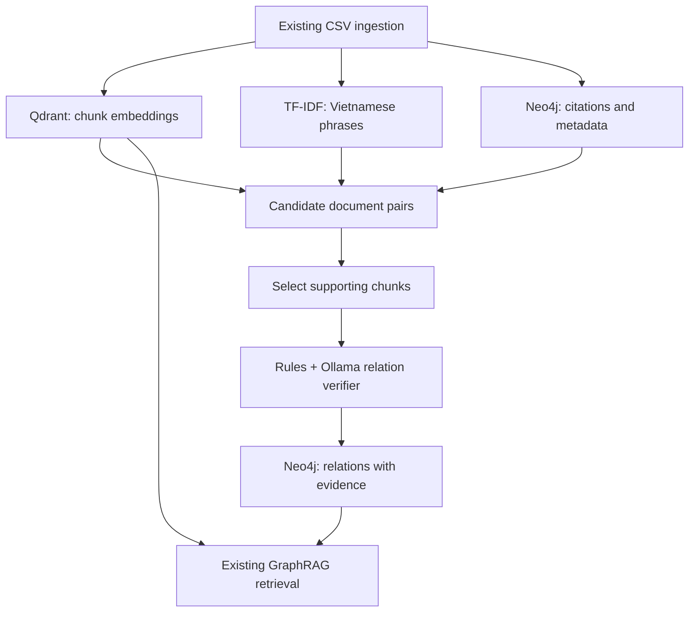

# Plan: evidence-backed legal relations

## Goal

Extend this repository from metadata/citation expansion to a small legal relation graph for Vietnamese documents. Find **candidate pairs** with cheap signals, inspect only the relevant chunks with Ollama, and store relations that have traceable evidence. Keep the current Qdrant → Neo4j → Qdrant answer flow working.

## What is already here

- `pipeline.py` ingests the CSV in batches and indexes article-aware chunks in Qdrant and Neo4j.
- `extraction.py` finds document numbers. `MENTIONS.kinds` is a heuristic; it is **not** a verified amendment or repeal.
- `graph_store.py` connects documents through identifiers and shared metadata. It resolves a cited number only when exactly one document owns it.
- `retrieval.py` uses Qdrant seeds, Neo4j neighbors, and Qdrant confirmation. `service.py` grounds answers in returned chunks.

Keep `Document`, `Chunk`, `Instrument`, and the existing CLI/API intact. Use the current `Chunk.section` as article-level evidence; a long article may span several chunks. Add separate `Article`/`Clause` nodes later only if headings can be parsed reliably from this corpus.

## Flow



## Build in this order

Keep orchestration in a small new `relation_builder.py`. Extend `extraction.py` for reference spans, `qdrant_store.py` for reading/searching existing vectors, `graph_store.py` for relation writes/expansion, and `cli.py` for the command. Add the TF-IDF dependency to `requirements.txt`; put only useful tuning settings in `config.py`. Change `retrieval.py`/`service.py` when the stored relations are ready.

### 1. Add a separate relation-building command

- Add `legal-graphrag build-relations <same-csv-path> [--limit N]`. Run it **after** `ingest`, so candidates can see the whole indexed corpus rather than only one ingestion batch. Require matching ready document IDs; report missing/outdated IDs.
- Make the command rerunnable: upsert the same relation instead of duplicating it. When ingestion replaces a document, remove derived relations touching that document; the next relation build recreates valid ones. Do not clear Qdrant or unrelated graph nodes.
- Start with a small corpus/`--limit`; expose candidate counts, Ollama calls, accepted relations, rejected relations, and elapsed time.

### 2. Resolve explicit references first

- Reuse `normalize_document_number` and existing `Instrument` ownership. Extract the **source chunk and exact text span** for each document-number reference. Keep ambiguous or missing target numbers unresolved.
- A clear reference can produce `CITES`. Treat nearby words such as `sửa đổi`, `bãi bỏ`, and `thay thế` as **hints**, since the current 100-character window can attach a verb to the wrong number. Verify the particular passage before storing `AMENDS`, `REPEALS`, or `REPLACES`.
- Retain the old `MENTIONS` edges for discovery and backward compatibility. Never copy `MENTIONS.kinds` directly into a verified relation.

### 3. Find other candidates cheaply

- **Dense:** reuse Qdrant's existing chunk vectors. Search from a bounded number of representative article chunks per document; take about 20 neighboring documents after deduplication. Keep the chunk IDs that produced each match. Do not recompute an embedding for every possible document pair.
- **Lexical:** fit a sparse TF-IDF index over chunk **bodies**, excluding the repeated title/number/section header. Start with Vietnamese whitespace-token 1–4-grams, `sublinear_tf=True`, `min_df=2`, `max_df=0.8`, and a capped vocabulary. Adjust the small sample case so it does not lose every term. Retrieve about 20 neighbors without building a dense all-pairs matrix. Compare Vietnamese word segmentation as a later experiment if this baseline misses key phrases.
- **Entities:** reuse the normalized agency/field/sector nodes as weak candidate signals. Cap neighbors from very common values. For normalized, reviewed legal phrases, connect `Document` to `LegalConcept` with a supporting chunk ID. Raw n-grams are candidate features, not automatically legal concepts.
- Union the dense, lexical, entity, and resolved-reference candidates. Deduplicate `(source_document_id, target_document_id)`; preserve each signal's score and evidence chunk IDs. Always retain unambiguous explicit references. Rank other candidates with reciprocal rank fusion (dense + lexical), using entity overlap as a tie-breaker, and cap the pairs sent to Ollama. Tune the cap/ranking with reviewed examples rather than assuming fixed similarity weights.

### 4. Verify and save relations

- For each shortlisted pair, send Ollama only the relevant source/target chunks and identifiers, never two complete laws. Require JSON with `source_id`, `target_id`, `kind`, `source_chunk_id`, optional `target_chunk_id`, an exact supporting quote, and `NONE` when evidence is insufficient.
- Initially allow `CITES`, `AMENDS`, `REPEALS`, `REPLACES`, `IMPLEMENTS`, and `GUIDES_IMPLEMENTATION_OF`. Accept only a known kind, real IDs, an unambiguous target, and a quote found in the supplied source chunk. Reject malformed or unsupported output. A model confidence number alone is not proof.
- Store `(:Document)-[:LEGAL_RELATION {kind, source_chunk_id, target_chunk_id, evidence, method}]->(:Document)`. Use a stable source + target + kind key for idempotent writes; keep provenance so an edge can be inspected or rebuilt. `SHARES_CONCEPT` belongs through a `LegalConcept` node; topical similarity alone does not create a normative relation.
- For `DEFINES` or `REGULATES`, wait until a grounded concept/entity extraction step exists; then connect the relevant chunk/article to that concept. Later, consider `Article`/`Clause` and typed nodes for rights, obligations, procedures, and penalties when extraction quality is measured. Do not label document-to-document similarity with those types.

### 5. Use the new graph in answers

- Update `GraphStore.expand()` to prioritize verified legal relations over broad shared metadata. Preserve Qdrant confirmation, query filters, context limits, and existing citation handling.
- Return the supporting source chunk for a claimed graph relation. The answer prompt should receive that actual text; a relation label or graph score by itself is not answer evidence.

## Check the result

Use the existing test suite and lint command; **do not create new test files**. Then run a disposable local ingestion and relation build with `data/sample_legal_documents.csv`:

```bash
PYTHONPATH=src python -m unittest discover -s tests -v
ruff check src tests
legal-graphrag ingest data/sample_legal_documents.csv --recreate
legal-graphrag build-relations data/sample_legal_documents.csv
legal-graphrag ask "Văn bản nào bãi bỏ Quyết định 01/2026/QĐ-UBND?"
```

Use `--recreate` **only** against disposable local Neo4j/Qdrant data. Manually confirm `sample-003` has a supported repeal relation to `sample-001`, the reference to `29/2013/QH13` stays unresolved if that law is absent, and a repeated build does not increase the edge count.

For a larger manually reviewed sample, compare TF-IDF only, dense only, their union, +entities, and +explicit references. Record candidate Recall@5/10/20, relation precision/recall/F1 by kind, whether each evidence quote truly supports the edge, Ollama call count, runtime, and answer quality against the existing retrieval baseline. Update `README.md` with the command, graph schema, and observed results. Keep generated scores and manual review notes out of the committed source tree unless they are needed as a documented research artifact.
